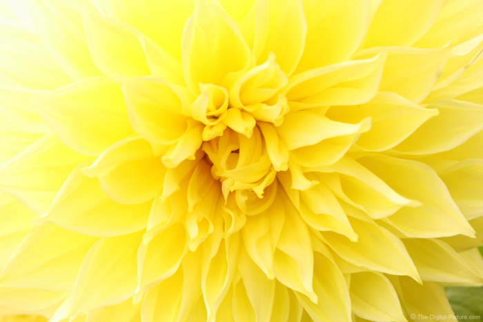

# PicoPil
Try to extract color from the second image and apply it to the first image with statistics method.

## RGB
In this method, we sort the color frequency by RGB method in each image. 
Then we change color(R,G,B) pixel of first image by the equal on the second image color(R,G,B) sorted list.

## HSV
In this method, we sort the color frequency by Hue in HSV method in each image. 
Then we change Hue in color(H,S,V) pixel of first image by the equal on the second image Hue in color(H,S,V) sorted list.

## Hybrid
In this method, we sort the color frequency by RGB method in each image. 
Then we change Hue in color(H,S,V) pixel of first image by the equal on the second image Hue in color(H,S,V) sorted list.

Method  |  First Image              |  Second Image             |  Result
:------:|:-------------------------:|:-------------------------:|:------------------------------------: 
RGB     |      |      | 
HSV     |      |      | 
Hybrid  |      |      | 
